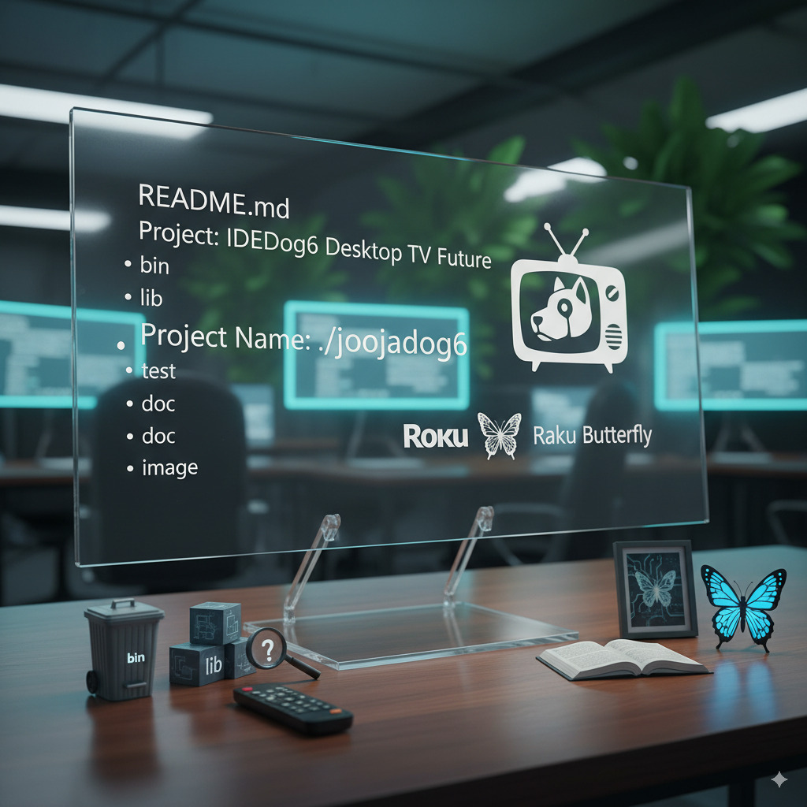
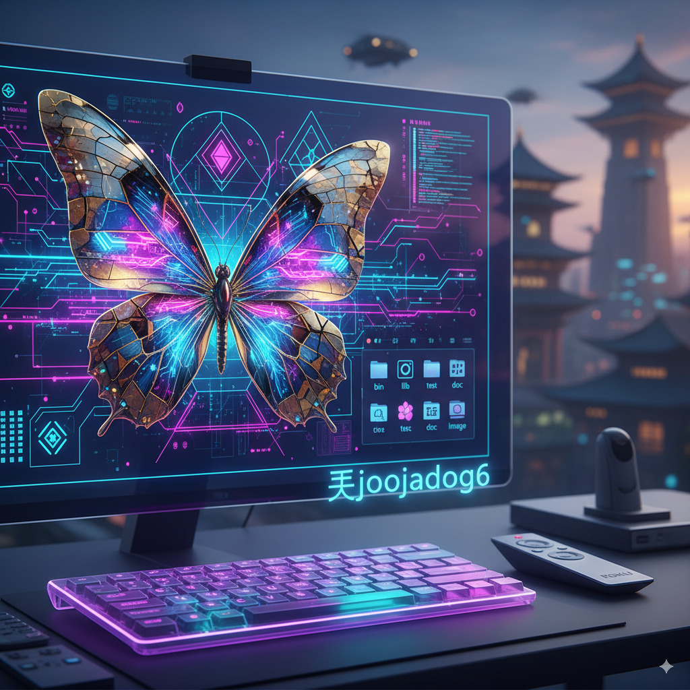

Sounds like you're setting up a project structure and want to include some fun elements! Here's a possible README.md for your "joojadog6" project, incorporating your ideas:


---



# Joojadog6: Desktop Future

## Project Overview

Welcome to **Joojadog6**, a project aimed at exploring the "Desktop Future" with a unique blend of functionality and artistic flair. This repository houses the core components, documentation, and resources for our journey into innovative desktop environments, inspired by the spirit of Roku and Raku Butterfly.

## Table of Contents

- [Project Overview](#project-overview)
- [Directory Structure](#directory-structure)
- [Getting Started](#getting-started)
- [Roku Integration (Planned)](#roku-integration-planned)
- [Raku Butterfly Theme](#raku-butterfly-theme)
- [Contributing](#contributing)
- [License](#license)

## Directory Structure

Our project follows a standard and organized directory structure:

```
./joojadog6/
├── bin/          # Executable scripts and compiled binaries
├── lib/          # Libraries and dependencies
├── test/         # Unit tests and integration tests
├── doc/          # Project documentation, guides, and manuals
├── image/        # Project-related images, icons, and assets
└── README.md     # This file
```

## Getting Started

*(This section will be populated with specific instructions on how to set up, build, and run your project once development progresses. For now, it's a placeholder.)*

## Roku Integration (Planned)

We envision a future where Joojadog6 can seamlessly integrate with Roku devices, offering extended functionality and user experiences. This is a key area of future development and exploration.

## Raku Butterfly Theme

The aesthetic and philosophical inspiration for Joojadog6 draws heavily from the elegance and transformation associated with the Raku Butterfly. Expect to see elements of this theme reflected in our UI/UX designs and possibly in our codebase.

Here's a visual representation of the Raku Butterfly inspiration:
