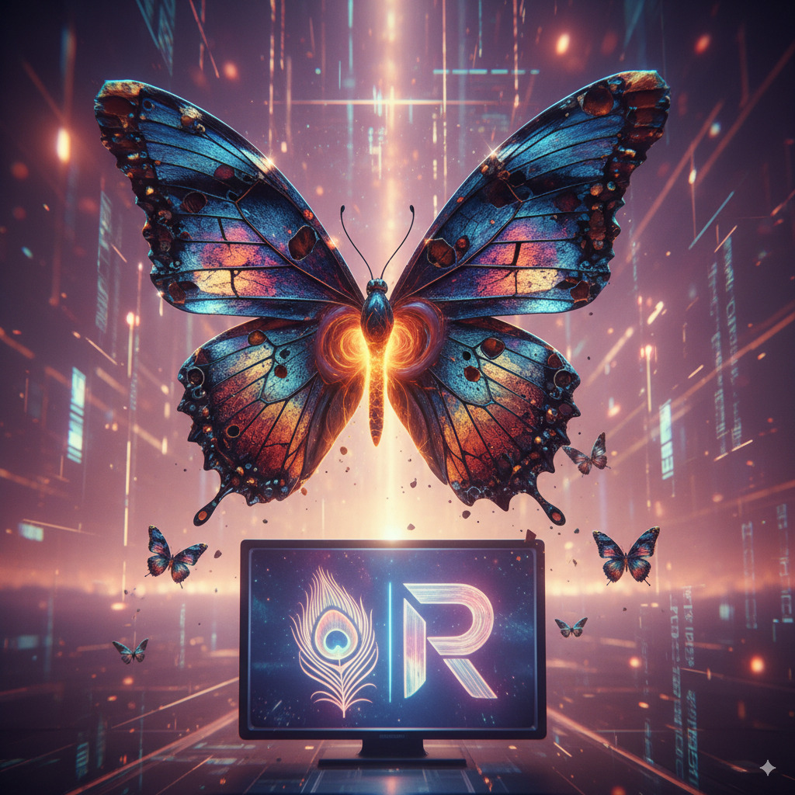

That's an interesting combination of words! Let's break it down and see if we can connect them.

**TV Future:**

The future of TV is definitely leaning towards streaming and on-demand content. Traditional cable is slowly being replaced by services that offer a vast library of shows and movies, accessible anytime, anywhere. This is where companies like Roku come in.

**Roku:**

Roku is a major player in this future. It's a brand of hardware digital media players that allow users to access streaming content from various online services. They also have their own operating system for smart TVs, making it even easier for people to cut the cord and embrace streaming.

**Raku Butterfly:**

This is where it gets a little more abstract! "Raku" is a type of Japanese pottery that's known for its unique firing process and often iridescent, metallic glazes. A "Raku butterfly" could evoke an image of delicate beauty, perhaps with a shimmering, almost magical quality, like this: 

Could you be thinking of a metaphorical connection? Perhaps the "Raku butterfly" represents the evolving, beautiful, and perhaps even fragile nature of new technologies and artistic expression in the TV landscape.

**CNN:**

CNN is a major news organization that has also adapted to the streaming era. They have their own streaming service, CNN+, which aims to deliver live and on-demand news content to a broader audience, moving beyond traditional cable viewership.

**Connecting the dots:**

So, if we tie it all together, we could say that the "TV future" is being shaped by companies like "Roku" and news organizations like "CNN" that are embracing streaming. The "Raku butterfly" could be a symbolic representation of this transformation – a delicate yet vibrant evolution in how we consume media, constantly shifting and revealing new patterns, much like the iridescent glaze on Raku pottery.

Is there a specific connection you were thinking of between "Raku butterfly" and the others? I'm curious to hear your thoughts!